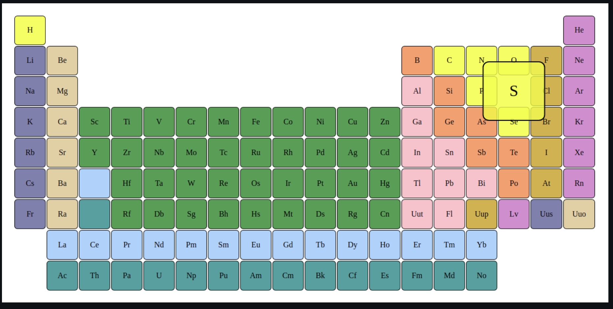

# periodic-table

**an assignment to color the periodic table using pseudo class :nth-child only**
_For practicing purpose_

[Test it by yourself](https://altinawiwaseem.github.io/periodic-table/)

---

---

### about the project

- using html & css only
- targeting the elements using pseudo class :nth-child

#### Developed with

- [x] _HTML5_
- [x] _CSS3_
- [ ] _SASS_
- [ ] _SCSS_
- [ ] _JavaScript_
- [ ] _React_
- [ ] _Bootstrap_
- [ ] _npm_
- [ ] _..._

---

### Contact

Email: <wasemm@live.com> 
GitHub: [Altinawiwaseem](https://github.com/altinawiwaseem)

---

### Used Tools

- [Visual Studio Code](https://code.visualstudio.com/)

---
